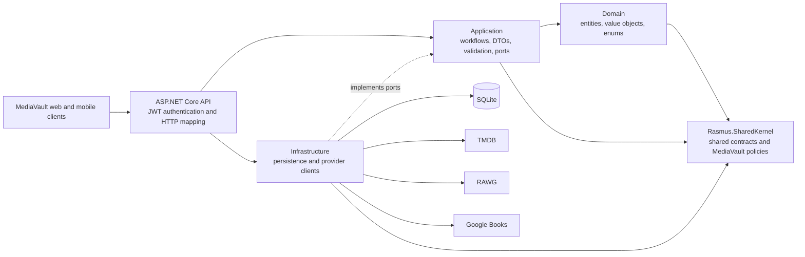

# MediaVault API

> Part of the **[MediaVault project](https://github.com/Megaraz/MediaVault)**.
> For the product overview, screenshots, architecture map, roadmap, and
> one-command workspace setup, start in the main repository. Client code lives
> in **[MediaVault.Clients](https://github.com/Megaraz/MediaVault.Clients)**.

MediaVault is a personal library for movies, TV series, games, books, and
manga. This repository contains the ASP.NET Core backend that owns
authentication, library data, persistence, and external metadata integrations.
The React web and Expo/React Native mobile applications live in
[MediaVault.Clients](https://github.com/Megaraz/MediaVault.Clients).

> **Status:** active pre-release development. The core API workflows are
> functional, but no public production deployment is available yet.

[](https://github.com/Megaraz/MediaVault.Api/actions/workflows/ci.yml)

## What works today

- JWT bearer registration, login, authenticated profile access, and protected
  library operations
- Type-specific create, read, update, and delete workflows for movies, TV
  series, games, books, and manga
- Status, rating, review, genre, release, image, and type-specific metadata
- SQLite persistence through Entity Framework Core migrations
- Backend-owned integrations with TMDB, RAWG, and Google Books
- Development OpenAPI document at `/openapi/v1.json`
- A global unexpected-failure boundary with safe client responses
- Vendor-neutral OpenTelemetry instrumentation and an optional standalone
  Aspire Dashboard workflow for local diagnostics

## External metadata providers

Provider calls are made by the backend, so credentials are never shipped to a
client.

| Provider | Media types | Use in MediaVault |
| --- | --- | --- |
| [TMDB](https://www.themoviedb.org/) | Movies and TV series | Title search, artwork, genres, overview, release information, runtime, and episode/season metadata |
| [RAWG](https://rawg.io/apidocs) | Games | Title search, artwork, genres, release information, platforms, and developer metadata |
| [Google Books](https://developers.google.com/books) | Books and manga | Title search, covers, descriptions, categories, publication details, authors, and page counts |

Provider payloads are treated as untrusted external data and mapped to
MediaVault-owned DTOs before reaching clients. Provider keys belong in local
user secrets or deployment environment variables, never in source control.

TMDB attribution notice: *This product uses the TMDB API but is not endorsed or
certified by TMDB.* See
[TMDB's attribution requirements](https://developer.themoviedb.org/docs/faq).

## Architecture



The repository follows a layered dependency direction: Domain contains the core
model, Application owns use cases and ports, Infrastructure implements
persistence and external integrations, and API is the composition and transport
boundary. Clients communicate with the system only through the HTTP API.

| Path | Responsibility |
| --- | --- |
| `media-vault-app.Domain` | Entities, value objects, enums, and domain-facing contracts |
| `media-vault-app.Application` | Use cases, service contracts, DTOs, validation, and mapping |
| `media-vault-app.Infrastructure` | EF Core, SQLite, repositories, migrations, and external HTTP clients |
| `media-vault-app.API` | Composition root, JWT bearer authentication, controllers, and HTTP response mapping |
| `Rasmus.SharedKernel` | Shared entity contracts plus MediaVault-owned validation and pagination helpers |
| `media-vault-app.Tests` | Application and API-focused xUnit tests |
| `Rasmus.SharedKernel.Tests` | Tests for MediaVault-owned shared validation, pagination, and result policies |
| `docs` | Architecture decisions, completed plans, and operational documentation |

The backend targets .NET 10 and uses EF Core with SQLite. Exact dependency
versions are defined by the checked-in project files and resolved lock state.

## Run locally

### Prerequisites

- [.NET 10 SDK](https://dotnet.microsoft.com/download/dotnet/10.0)
- EF Core CLI 10.0.9, if it is not already installed:

  ```powershell
  dotnet tool install --global dotnet-ef --version 10.0.9
  ```

### Configure the API

The checked-in
[`appsettings.example.json`](media-vault-app.API/appsettings.example.json)
documents the required shape. Store local values with
[ASP.NET Core user secrets](https://learn.microsoft.com/en-us/aspnet/core/security/app-secrets?view=aspnetcore-10.0):

```powershell
dotnet user-secrets set "ConnectionStrings:Default" "Data Source=mediavault.db" --project media-vault-app.API

dotnet user-secrets set "Jwt:SecretKey" "<local-random-secret-at-least-32-characters>" --project media-vault-app.API
dotnet user-secrets set "Jwt:Issuer" "MediaVault.Local" --project media-vault-app.API
dotnet user-secrets set "Jwt:Audience" "MediaVault.Local" --project media-vault-app.API
dotnet user-secrets set "Jwt:ExpiryMinutes" "10080" --project media-vault-app.API

dotnet user-secrets set "ExternalApis:Rawg:BaseUrl" "https://api.rawg.io/api/" --project media-vault-app.API
dotnet user-secrets set "ExternalApis:Rawg:ApiKey" "<rawg-api-key>" --project media-vault-app.API
dotnet user-secrets set "ExternalApis:Tmdb:BaseUrl" "https://api.themoviedb.org/3/" --project media-vault-app.API
dotnet user-secrets set "ExternalApis:Tmdb:ApiAccessToken" "<tmdb-read-access-token>" --project media-vault-app.API
dotnet user-secrets set "ExternalApis:GoogleBooks:BaseUrl" "https://www.googleapis.com/books/v1/" --project media-vault-app.API
dotnet user-secrets set "ExternalApis:GoogleBooks:ApiKey" "<google-books-api-key>" --project media-vault-app.API
```

All provider configurations are validated when the API starts. Use your own
development credentials and review each provider's terms, attribution rules,
and quotas.

### Restore, migrate, and start

```powershell
dotnet restore
dotnet ef database update --project media-vault-app.Infrastructure --startup-project media-vault-app.API
dotnet run --project media-vault-app.API --launch-profile http
```

The HTTP launch profile serves the API at `http://localhost:5210`. In the
Development environment, OpenAPI JSON is available at
`http://localhost:5210/openapi/v1.json`.

The SQLite file is ignored runtime state. EF Core migrations are the schema
history; never share the backend database file with a client or commit it.

## Authentication and security

The API uses JWT bearer authentication. User-owned operations obtain the user
identifier from validated claims rather than trusting a client-supplied owner
identifier. Signing keys, provider credentials, connection secrets, tokens,
passwords, and local database contents must not be committed or logged.

API routes, status codes, JSON and error shapes, pagination, and synchronization
metadata are contracts consumed by both clients. Intentional contract changes
must be coordinated with
[MediaVault.Clients](https://github.com/Megaraz/MediaVault.Clients).

## Observability

The primary local workflow is the Aspire AppHost in the
[`Megaraz/MediaVault`](https://github.com/Megaraz/MediaVault) workspace. It
orchestrates the API and selected clients and displays their local logs,
traces, metrics, and resource state. The
[standalone Aspire Dashboard guide](docs/standalone-aspire-dashboard.md) remains
available for backend-only diagnostics without the workspace AppHost. Neither
workflow is a production monitoring system.

## Verification

Run from the repository root:

```powershell
dotnet test media-vault-app.slnx
git diff --check
```

Pull requests and pushes to `main` run the .NET 10 backend tests. See
[continuous integration](docs/continuous-integration.md) for exact commands and
repository policy.

## Current direction

MediaVault remains a public portfolio project, a live personal product, and a
deliberate learning environment. Current directions include explicit
cancellation, timeout, retry, and rate-limit policies; production-minded
telemetry and deployment; a designed offline-sync contract; and a narrow,
privacy-conscious recommendation feature. These remain roadmap work unless the
checked-in code proves otherwise.

Work is tracked in the
[MediaVault GitHub Project](https://github.com/users/Megaraz/projects/2). The
completed [ResultPattern migration record](docs/resultpattern-migration-plan.md)
and [public repository readiness audit](docs/public-repository-readiness-audit.md)
record important compatibility and publication decisions. The
[error/observability verification](docs/error-observability-verification.md)
records the current diagnostics foundation and its remaining boundaries.

## Related ResultPattern packages

- [`Megaraz.ResultPattern` 0.2.2](https://www.nuget.org/packages/Megaraz.ResultPattern/0.2.2)
- [`Megaraz.ResultPattern.AspNetCore` 0.1.1](https://www.nuget.org/packages/Megaraz.ResultPattern.AspNetCore/0.1.1)
- [`Megaraz.ResultPattern.Infrastructure` 0.1.0](https://www.nuget.org/packages/Megaraz.ResultPattern.Infrastructure/0.1.0)

`Rasmus.SharedKernel` retains only shared entity contracts and explicitly
MediaVault-owned validation, pagination, result-message, diagnostic, and
logging abstractions; it does not contain a duplicate ResultPattern
implementation.

## Repository policies

- [Contributing](CONTRIBUTING.md)
- [Code of Conduct](CODE_OF_CONDUCT.md)
- [Security](SECURITY.md)
- [MIT License](LICENSE)
