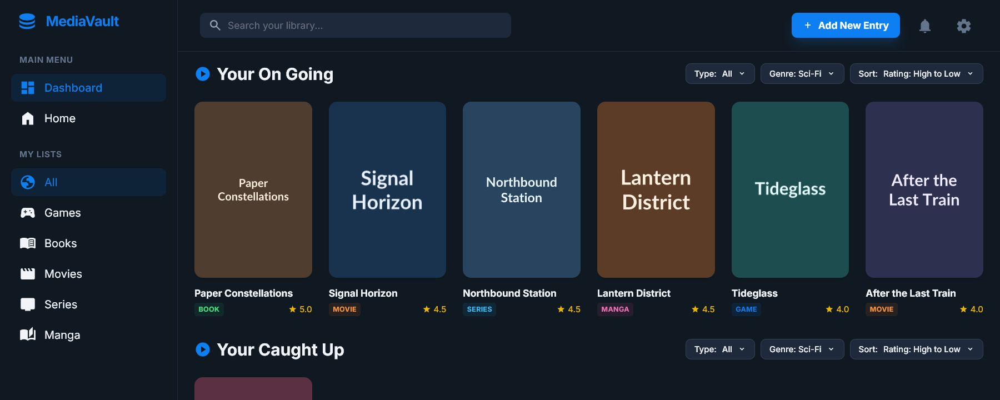
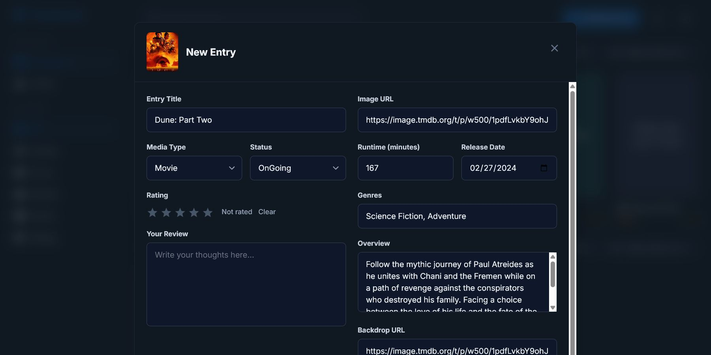
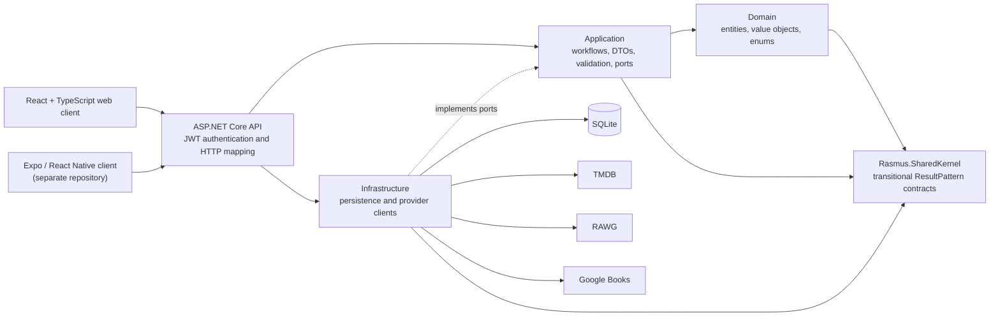

# MediaVault

MediaVault is a personal library for movies, TV series, games, books, and manga.
Users can build a library, track progress and ratings, write reviews, and fill an
entry from external metadata providers.

This repository contains the ASP.NET Core API and React web client. A separate
[Expo/React Native Android client](https://github.com/Megaraz/media-vault-android)
uses the same API.

> **Status:** active pre-release development. The core API and web workflows are
> functional, but no public production deployment is available yet.

[](https://github.com/Megaraz/media-vault-app/actions/workflows/ci.yml)

## Product tour

The screenshots use a synthetic demo account and fictional library data. No
real account details, tokens, or API credentials are shown.

### Organize a personal library

The authenticated dashboard groups entries by status and supports media-type
filtering, library search, sorting, and create/edit flows.



### Search an external catalog

Typing at least three title characters searches the provider for the selected
media type. Movies and TV series use TMDB, as shown here.


### Review and edit imported metadata

Selecting a result fills the editable metadata fields; it does not save the
entry automatically.



## What works today

- JWT bearer registration, login, authenticated profile access, and protected
  library operations
- Type-specific create, read, update, and delete workflows for movies, TV
  series, games, books, and manga
- Status, rating, review, genre, release, image, and type-specific metadata
- Dashboard grouping, media-type filters, title search, and sorting
- Provider-backed title search and metadata autofill
- SQLite persistence through Entity Framework Core migrations
- Development OpenAPI document at `/openapi/v1.json`
- Shared API contracts consumed by the web client and the separately maintained
  Android client

## External metadata providers

Provider calls are made by the backend so credentials do not need to be shipped
to either client.

| Provider | Media types | Use in MediaVault |
| --- | --- | --- |
| [TMDB](https://www.themoviedb.org/) | Movies and TV series | Title search, artwork, genres, overview, release information, runtime, and episode/season metadata |
| [RAWG](https://rawg.io/apidocs) | Games | Title search, artwork, genres, release information, platforms, and developer metadata |
| [Google Books](https://developers.google.com/books) | Books and manga | Title search, covers, descriptions, categories, publication details, authors, and page counts |

The provider responses are treated as untrusted external data and mapped to
MediaVault-owned DTOs before reaching clients. Provider keys belong in local
user secrets or deployment environment variables, never in source control.
Visible provider attribution in the product UI is a deployment-readiness
follow-up.

TMDB attribution notice: *This product uses the TMDB API but is not endorsed or
certified by TMDB.* See [TMDB's attribution requirements](https://developer.themoviedb.org/docs/faq).

## Architecture



The repository follows a layered dependency direction: Domain contains the core
model, Application owns use cases and ports, Infrastructure implements
persistence and external integrations, and API is the composition and transport
boundary. The clients communicate with the system only through the API.

| Path | Responsibility |
| --- | --- |
| `media-vault-app.Domain` | Entities, value objects, enums, and domain-facing contracts |
| `media-vault-app.Application` | Use cases, service contracts, DTOs, validation, and mapping |
| `media-vault-app.Infrastructure` | EF Core, SQLite, repositories, migrations, and external HTTP clients |
| `media-vault-app.API` | Composition root, JWT bearer authentication, controllers, and HTTP response mapping |
| `media-vault-app.client` | React 19, TypeScript, Vite, and Tailwind web client |
| `Rasmus.SharedKernel` | Shared entity contracts plus MediaVault-owned validation and pagination helpers |
| `media-vault-app.Tests` | Application and API-focused xUnit tests |
| `Rasmus.SharedKernel.Tests` | Tests for the transitional shared kernel |
| `docs` | Architecture decisions, active plans, and repository documentation |

The backend currently targets .NET 10. The web client uses React 19, TypeScript,
Vite, and Tailwind. Exact dependency versions are pinned in the project
manifests and lock file.

## Run locally

### Prerequisites

- [.NET 10 SDK](https://dotnet.microsoft.com/download/dotnet/10.0)
- [Node.js 24](https://nodejs.org/) and npm
- EF Core CLI 10.0.9, if it is not already installed:

  ```powershell
  dotnet tool install --global dotnet-ef --version 10.0.9
  ```

The HTTPS Vite development server uses the local ASP.NET Core development
certificate. Trust it once if necessary:

```powershell
dotnet dev-certs https --trust
```

### 1. Configure the API

The checked-in [`appsettings.example.json`](media-vault-app.API/appsettings.example.json)
documents the required shape. For local development, store the values with
[ASP.NET Core user secrets](https://learn.microsoft.com/en-us/aspnet/core/security/app-secrets?view=aspnetcore-10.0):

```powershell
dotnet user-secrets set "ConnectionStrings:Default" "Data Source=mediavault.db" --project media-vault-app.API

dotnet user-secrets set "Jwt:SecretKey" "<local-random-secret-at-least-32-characters>" --project media-vault-app.API
dotnet user-secrets set "Jwt:Issuer" "MediaVault.Local" --project media-vault-app.API
dotnet user-secrets set "Jwt:Audience" "MediaVault.Local" --project media-vault-app.API
dotnet user-secrets set "Jwt:ExpiryMinutes" "10080" --project media-vault-app.API

dotnet user-secrets set "ExternalApis:Rawg:BaseUrl" "https://api.rawg.io/api/" --project media-vault-app.API
dotnet user-secrets set "ExternalApis:Rawg:ApiKey" "<rawg-api-key>" --project media-vault-app.API
dotnet user-secrets set "ExternalApis:Tmdb:BaseUrl" "https://api.themoviedb.org/3/" --project media-vault-app.API
dotnet user-secrets set "ExternalApis:Tmdb:ApiAccessToken" "<tmdb-read-access-token>" --project media-vault-app.API
dotnet user-secrets set "ExternalApis:GoogleBooks:BaseUrl" "https://www.googleapis.com/books/v1/" --project media-vault-app.API
dotnet user-secrets set "ExternalApis:GoogleBooks:ApiKey" "<google-books-api-key>" --project media-vault-app.API
```

All three provider configurations are currently validated when the API starts.
Use your own development credentials and review each provider's current terms,
attribution rules, and quotas.

### 2. Restore, migrate, and start the API

From the repository root:

```powershell
dotnet restore
dotnet ef database update --project media-vault-app.Infrastructure --startup-project media-vault-app.API
dotnet run --project media-vault-app.API --launch-profile http
```

The HTTP launch profile serves the API at `http://localhost:5210`. In the
Development environment, its OpenAPI JSON is available at
`http://localhost:5210/openapi/v1.json`.

The SQLite file is local runtime state and is ignored by Git. EF Core migrations
are the schema history; do not share the backend database file with a client or
commit it to the repository.

### 3. Start the web client

In a second terminal:

```powershell
cd media-vault-app.client
npm ci
npm run dev
```

Open `https://localhost:61366`, create an account, and sign in to reach the
dashboard. The Vite development server proxies the API routes to
`http://localhost:5210` by default. `ASPNETCORE_HTTPS_PORT` or
`ASPNETCORE_URLS` can override that target when needed.

## Authentication notes

The API currently uses JWT bearer authentication. The web client obtains a token
at login and attaches it through its centralized transport helper. Its current
browser storage choice is a pre-release implementation decision, not a
recommendation for mobile or production credential storage. The Android client
has its own secure-storage requirements.

## Verification

Run backend verification from the repository root:

```powershell
dotnet test media-vault-app.slnx
```

Run frontend verification from `media-vault-app.client`:

```powershell
npm ci
npm run lint
npm run build
```

Pull requests and pushes to `main` run independent .NET 10 backend tests and
Node 24 frontend lint/build checks. See
[continuous integration](docs/continuous-integration.md) for the exact
commands, permissions, and test-configuration expectations. The frontend does
not yet have an established automated test suite; lint and production build are
its current automated checks.

## Current direction

MediaVault began as a final-year backend-development exam project and continues
as:

1. a public, technically honest portfolio project;
2. a live web and Android product the developer can genuinely use; and
3. a deliberate environment for learning and improving engineering judgment.

Current and planned work is tracked in
[GitHub Project 2](https://github.com/users/Megaraz/projects/2). Key directions
include:

- migrating from the local ResultPattern implementation to the published
  Megaraz packages;
- a global boundary for unexpected API failures;
- explicit cancellation, timeout, retry, and rate-limit policies;
- React Query for web server state and a designed offline-sync model for
  Android;
- production-minded telemetry and deployment; and
- a narrow, privacy-conscious AI recommendation feature.

These are roadmap items, not claims about the current implementation. See the
[ResultPattern migration plan](docs/resultpattern-migration-plan.md) and
[public repository readiness audit](docs/public-repository-readiness-audit.md)
for the active decisions and known gaps.

### Related ResultPattern packages

The reusable ResultPattern work has been extracted and published as independent
NuGet packages:

- [`Megaraz.ResultPattern` 0.2.2](https://www.nuget.org/packages/Megaraz.ResultPattern/0.2.2)
- [`Megaraz.ResultPattern.AspNetCore` 0.1.1](https://www.nuget.org/packages/Megaraz.ResultPattern.AspNetCore/0.1.1)
- [`Megaraz.ResultPattern.Infrastructure` 0.1.0](https://www.nuget.org/packages/Megaraz.ResultPattern.Infrastructure/0.1.0)

MediaVault still uses `Rasmus.SharedKernel` while the characterized migration is
pending. The published packages are related portfolio work, not yet the
application's active implementation.

## Repository policies

- [Contributing](CONTRIBUTING.md)
- [Code of Conduct](CODE_OF_CONDUCT.md)
- [Security](SECURITY.md)
- [MIT License](LICENSE)
