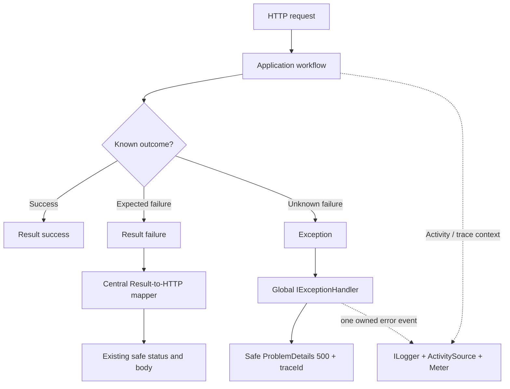
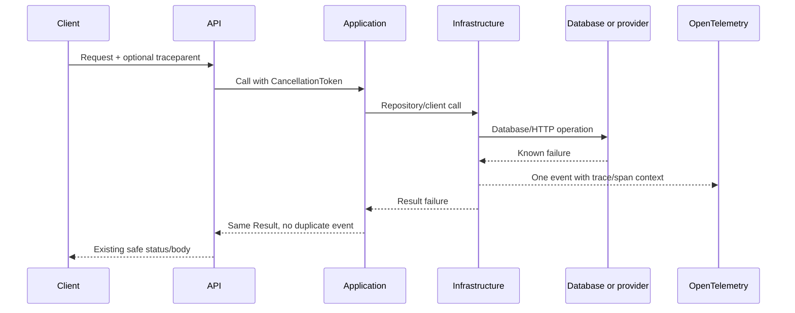
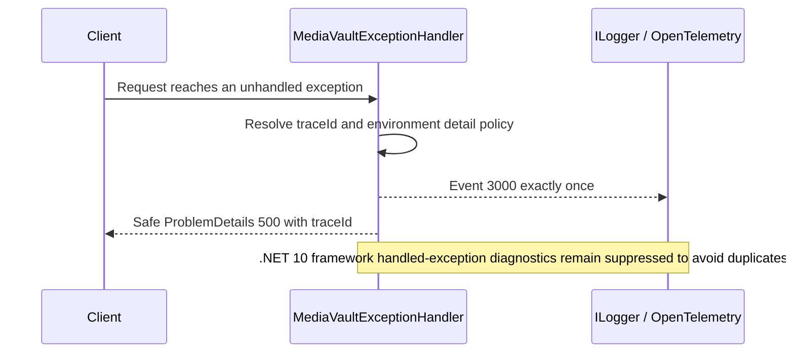
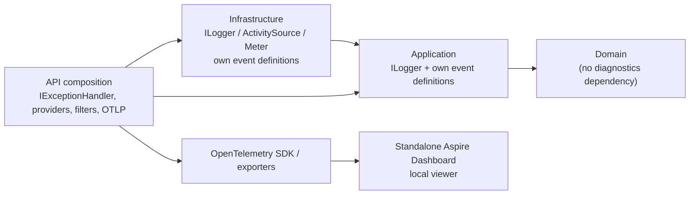

# MediaVault error handling and observability policy

**Status:** Approved on 2026-08-08 for implementation by issues #107-#113

**Decision issue:** [#106](https://github.com/Megaraz/media-vault-app/issues/106)

**Roadmap parent:** [#105](https://github.com/Megaraz/media-vault-app/issues/105)

**Compatibility baseline:** [`resultpattern-migration-plan.md`](resultpattern-migration-plan.md), especially D6, D9, and D10

This document is the durable policy for backend errors, logs, traces, and metrics in MediaVault. It records the system that exists before the observability migration, the approved target behavior, and the implementation contract for the remaining child issues.

It deliberately separates three states:

- **Current** describes code present when #106 was approved.
- **Target** describes approved behavior that later child issues must implement.
- **Future** describes production-monitoring choices that remain intentionally unresolved.

Issue #110 completed the custom-sink removal on 2026-08-13. Production code now uses standard .NET logging only: the NDJSON writer, readback/retention surface, cleanup hosted service, neutral file-logger contracts/models, and their registrations are absent. Sections 2 and Appendix A remain a historical inventory of the #106 baseline.

No runtime behavior changes in #106. API routes, authentication, authorization, owner isolation, status codes, JSON bodies, persistence, web behavior, and Android behavior remain unchanged.

### Living-document rule

This version is a decision and migration plan, not a claim that the target system already exists. Each implementation child must update the relevant target section with its actual files, classes, methods, options, event definitions, tests, and observed behavior. #113 performs the final integrated rewrite so this becomes the detailed contributor guide for the implemented system. Planned names are not treated as code until a child lands them.

## 1. Mental model

MediaVault uses the Result Pattern for failures the application understands and can represent safely. Exceptions are reserved for failures the current boundary cannot responsibly classify or recover from.



The rules are:

1. Expected failures are values, not exceptions.
2. Genuinely unexpected failures remain exceptions.
3. A failure has one operational logging owner.
4. A diagnostic failure must never change the user-facing result.
5. Public responses contain safe MediaVault text, never private diagnostics.
6. Trace correlation connects the response, logs, spans, and metrics without copying sensitive request data.

## 2. Current system inventory

### 2.1 Custom NDJSON components

| File and type | Current responsibility | Important methods or fields |
|---|---|---|
| `Rasmus.SharedKernel/Interfaces/ErrorLogger/IErrorLogger.cs` | Neutral contract used across Application and Infrastructure | `LogErrorToFileAsync`, `GetErrorLogsAsync`, `CleanOldLogsAsync` |
| `Rasmus.SharedKernel/Interfaces/ErrorLogger/IErrorLogPolicy.cs` | Determines whether a Result error should enter the file sink | `ShouldLog(Error)` |
| `Rasmus.SharedKernel/Diagnostics/ErrorLog.cs` | Persisted NDJSON record | `WriteDate`, `Code`, `Description`, `ErrorType`, `Layer`, `Service`, `Method`, `ExceptionMessage`, `StackTrace` |
| `Rasmus.SharedKernel/Diagnostics/ErrorLogContext.cs` | D6 origin metadata | Validated `Layer`, `Service`, and `Method` values |
| `media-vault-app.Infrastructure/Diagnostics/ErrorLogger.cs` | Serializes, appends, reads, and cleans NDJSON | `ErrorLoggerConfiguration`; static asynchronous `SemaphoreSlim`; camel-case `System.Text.Json` options |
| `media-vault-app.Infrastructure/Diagnostics/ErrorLogPolicy.cs` | Current Result-error classification | Skips validation, cancellation, and HTTP 400/404/409/422; logs other errors |
| `media-vault-app.Application/Services/ErrorLogCleanupService.cs` | File-sink maintenance hosted service | Cleans immediately on startup and then every 24 hours |
| `media-vault-app.API/Program.cs` | Composition | Registers `IErrorLogPolicy`, `IErrorLogger`, and `ErrorLogCleanupService`; writes under `AppContext.BaseDirectory/Logs/errors.log.ndjson` |

The cross-project placement is transitional. `ErrorLogCleanupService` lives in Application and requires the SharedKernel contract, while the concrete file implementation belongs to Infrastructure. Once the file sink and cleanup service disappear, this dependency reason disappears too.

### 2.2 Current NDJSON producers

#### Database repositories

`RepoBase<TEntity,TKey>` supplies the logging path used by inherited `UserRepo` operations; `DependentEntityRepoBase<TEntityDependent,TKeyOwner,TKeyDependent>` supplies it for inherited `MediaEntryRepo` operations.

The base classes catch repository exceptions and create package-native `DatabaseError` values through `DatabaseFailurePolicy`:

- `CreateAsync`, `DeleteAsync`, and `UpdateAsync` distinguish caller cancellation, `DbUpdateConcurrencyException`, `DbUpdateException`, and a final catch-all exception.
- Query methods such as `GetByIdAsync`, collection reads, and `ExistsAsync` distinguish caller cancellation from a final catch-all query failure.
- `LogAndFailAsync` and `LogAndFailAsync<T>` write an `ErrorLogContext("Infrastructure", GetType().Name, callerMethodName)` and then return the original failure.
- Logging is attempted with `CancellationToken.None` after the repository operation has failed. This prevents a cancelled request token from suppressing the diagnostic write.
- Every logging exception is swallowed. The original database `Result` is still returned.

The coverage is not complete. Several concrete-repository methods catch and translate database exceptions but return `Result.Failure(...)` directly instead of calling `LogAndFailAsync`:

- `UserRepo.RegisterUserAsync`, `CheckRegistrationAvailabilityAsync`, and `GetByUsernameOrEmailAsync`;
- `MediaEntryRepo.UpdateGameAsync`, its `UpdateAsync` TV-series path, and `SearchMediaEntriesAsync`.

`MediaEntryRepo.GetByIdAsync` delegates to the logging base implementation. The direct-return methods above are current diagnostic omissions, not approved exceptions to the target policy. #108 must migrate every concrete and inherited catch path so the same classification receives the same event exactly once.

`DatabaseFailurePolicy` currently produces these safe Result errors:

| Package code suffix | Current cause | Safe public message category |
|---|---|---|
| `DatabaseConcurrencyFailure` | `DbUpdateConcurrencyException` | Concurrency conflict |
| `DatabaseSaveChangesFailure` | `DbUpdateException` | Save failure |
| `DatabaseQueryFailure` | Any exception caught by a query method | Query failure |
| `DatabaseUnexpectedFailure` | Any remaining exception caught by a write method | Unexpected Infrastructure failure |

All four currently contain the original exception privately and are persisted by the NDJSON logger. All map through the existing Result-to-HTTP policy as safe HTTP 500 failures.

#### External-provider clients

`ApiClientBase.SendAndMapAsync<TValue>` is shared by `RawgApiClient`, `TmdbApiClient`, and `GoogleBooksApiClient`.

- The ResultPattern HTTP mapper classifies HTTP responses and inspects at most 2 MiB.
- MediaVault replaces package-facing messages with fixed text from `ExternalServiceResponsePolicy`.
- `HttpRequestException`, `TimeoutException`, and `TaskCanceledException` are mapped through the package transport mapper.
- Caller cancellation becomes a cancelled Result and is not logged.
- Non-caller cancellation, timeout, and transport failure become a logged `TransportFailure` Result with fixed public text and retain the existing HTTP 503 contract.
- `LogIfNeededAsync` writes one NDJSON entry using the derived provider-client class and caller method name.
- HTTP 400, 404, 409, and 422 are skipped. Authentication failures, authorization failures, rate limiting, server failures, transport failures, malformed responses, and unexpected responses are logged.
- Logging uses `CancellationToken.None`, and every logging exception is swallowed so the external-service Result is preserved.

### 2.3 Current standard `ILogger` producers

Application already uses `Microsoft.Extensions.Logging.ILogger`; this is separate from the NDJSON sink.

| Producer group | Current categories | Current level and content |
|---|---|---|
| `ReadServiceBase` and `WriteServiceBase` | Validation and propagated repository failures | `Debug`; validation code/description or Result code/description |
| `DependentEntityReadServiceBase` and `DependentEntityWriteServiceBase` | Validation, owner checks, propagated repository failures | `Debug`; validation or Result code/description |
| `AuthService` | Login/registration validation, repository failure, mapping failure | `Debug`; validation or Result code/description; invalid-password values are not logged |
| `MediaEntryReadService` | Search validation, owner check, mapping/repository failure | `Debug` |
| `TmdbApiService`, `RawgApiService`, and `GoogleBooksApiService` | Validation and propagated client failures | `Debug` |
| `UserReadService`, `UserWriteService`, `MediaEntryWriteService` | Supply typed logger categories to their base classes | No separate operational event definitions |

`ServiceValidationLogging.FormatValidationErrors` currently joins complete validation codes and descriptions into a multiline string. In Development, `Default=Debug` makes these messages visible. In the default configuration, `Default=Information` suppresses them.

These Application messages can currently duplicate a lower-level operational failure at Debug level. The target policy removes propagated-failure duplicates: the boundary that creates and classifies the failure owns the event.

### 2.4 Current sink behavior

`ErrorLoggerConfiguration` defaults to:

- file name `errors.log.ndjson`;
- base path `AppDomain.CurrentDomain.BaseDirectory` unless overridden by API composition;
- seven-day retention.

`Program.cs` overrides the base path to `AppContext.BaseDirectory/Logs`.

The sink:

- creates the directory before appending;
- serializes exactly one camel-case JSON object per line;
- uses a process-wide asynchronous lock for append, read, and cleanup;
- reads the complete file into memory;
- skips empty and corrupt lines on read;
- sends corrupt-line messages only to `Debug.WriteLine`;
- removes expired and corrupt records when cleanup rewrites the file;
- exposes readback only through `IErrorLogger.GetErrorLogsAsync`; there is no API endpoint or UI reader;
- has no file-size cap, rotation, cross-process lock, health signal, or standard log-provider integration.

Producer callsites isolate append failures, but `ErrorLogCleanupService.ExecuteAsync` does not catch cleanup I/O failures. A cleanup exception can fault the hosted service and, under the default .NET host behavior, stop the host. The target removes this file-maintenance risk rather than reproducing it in the standard telemetry pipeline.

### 2.5 Current configuration

`media-vault-app.API/appsettings.json` sets the default standard log level to `Information` and `Microsoft.AspNetCore` to `Warning`. `appsettings.Development.json` sets the default to `Debug`. Neither file configures OpenTelemetry, OTLP, a global exception handler, or structured diagnostic redaction.

### 2.6 Current focused tests

| Test | Contract protected today | Target disposition |
|---|---|---|
| `DatabaseFailurePolicy_UsesPackageCodesAndApprovedSafeMessages` | Database code, safe message, Result type, private exception | Retain as Result contract coverage |
| `ErrorLogPolicy_LogsDatabaseErrorsAndSkipsExpectedClientAndCancellationFailures` | NDJSON classification | Replace with event-policy tests |
| `ErrorLogger_PreservesNdjsonSchemaAndDropsCorruptAndExpiredEntries` | Schema, retention, corrupt-line removal | Delete only with the file sink |
| `RepositoryLoggingFailure_DoesNotHideTheDatabaseResult` | Logging failure isolation | Replace with standard-logging isolation/behavior coverage |
| `SharedMapping_PropagatesCallerCancellationWithoutLogging` | D9 caller-cancellation behavior | Retain and adapt to `ILogger` |
| `SharedMapping_MapsAndLogsNonCallerTransportFailuresOnce` | D9 transport mapping and one-event ownership | Retain and adapt to stable EventId/name |
| `ErrorLogCleanupServiceTests` | Startup cleanup behavior | Delete only with the cleanup service |

### 2.7 Current limitations to remove

- Operational logs are split between standard `ILogger` and a private file API.
- Concrete repository methods bypass the base logging helpers, so equivalent database failures do not have consistent diagnostic coverage.
- File records do not automatically carry ASP.NET trace/span identifiers.
- Application Debug messages repeat failures already owned by repositories or clients.
- Broad repository `catch (Exception)` blocks turn genuinely unknown failures into database Results.
- Exception messages and stack traces are persisted without an environment-aware export boundary.
- Logging failures are safely isolated but completely invisible.
- Readback and cleanup create Application/SharedKernel types that exist only for the custom sink.
- The sink cannot feed standard OpenTelemetry collection without a custom adapter.

## 3. Approved decision register

| ID | Decision | Approved resolution |
|---|---|---|
| EO1 | Expected versus unexpected failures | Known validation, not-found, conflict, authorization decisions, database failures, and known upstream failures remain Results. Truly unknown exceptions are not wrapped in a catch-all Result and reach the global exception boundary. |
| EO2 | Operational event ownership | Log once where the failure is first classified with enough context to act. Higher layers propagate the Result without repeating the event. The global handler alone owns unhandled exceptions. |
| EO3 | Severity | Expected local outcomes and caller cancellation are not Warning/Error events. Concurrency, upstream throttling, timeout, transport, and upstream 5xx are Warning. Database save/query failures, upstream auth/configuration/malformed failures, and unhandled exceptions are Error. |
| EO4 | Stable event identity | Source-generated `LoggerMessage` methods use the event catalog in section 5. Event IDs and names are diagnostic contracts and are not reused for different meanings. |
| EO5 | Correlation | W3C `Activity` trace/span identifiers are primary. ASP.NET `HttpContext.TraceIdentifier` is a fallback when no Activity exists. Safe 5xx ProblemDetails includes `traceId`; normal expected-failure bodies remain unchanged. |
| EO6 | Exception detail | Local Development diagnostics may include exception messages/stacks. Non-Development/exported telemetry contains exception type, safe classification, event identity, and trace context only. No response contains exception detail. |
| EO7 | Sensitive data | Never log JWTs, passwords/hashes, signing keys, provider credentials, authorization headers, reviews, request DTOs, raw upstream bodies, SQL, database values, or unnecessary personal identifiers. Validation events contain codes, not rejected values or complete descriptions. |
| EO8 | Diagnostic failure | Logging, tracing, metrics, and exporter failure must not fail a request, change a Result, trigger business retries, or create recursive application logging. Provider/exporter self-diagnostics are the troubleshooting path. |
| EO9 | Ownership after cleanup | The policy lives in this document. Each producing assembly owns source-generated event methods. API composition owns providers, filters, environment configuration, and exporters. SharedKernel owns no logging sink, event catalog, or exporter contract. |
| EO10 | Platform boundary | Application and Infrastructure emit through standard .NET APIs (`ILogger`, `ActivitySource`, and `Meter`). OpenTelemetry collects and exports them. Business code never depends on an exporter, Aspire, or a production vendor. |
| EO11 | Local and production responsibilities | The standalone Aspire Dashboard is an optional local, in-memory diagnostic viewer. Production storage, retention, alerting, sampling, cost, and vendor selection are future deployment decisions. |

## 4. Target ownership and severity matrix

| Failure class | Result or exception | Operational owner | Level | Event | Notes |
|---|---|---|---|---|---|
| Validation failure | Result | Application boundary that creates it | Debug only when diagnostically useful | 1000 | Codes only; no submitted value |
| Not found / conflict / application authorization decision | Result | None by default | None | — | Normal client-visible outcome; access logging/metrics may count it separately |
| Invalid login/password | Result | None | None | — | Avoid credential and user-enumeration signals |
| Caller-requested cancellation | Cancelled Result or propagated cancellation according to the existing boundary contract | None | None | — | Must not become 500 or dependency failure |
| Database concurrency | Result | Repository method | Warning | 2000 | One event; preserve safe Result contract |
| Database save/query failure with known classification | Result | Repository method | Error | 2001 | No repeat in Application or controller |
| Unknown repository/programming exception | Exception | Global handler | Error | 3000 | Broad repository catch must no longer hide it |
| Upstream timeout / transport failure / non-caller cancellation | Result | `ApiClientBase` | Warning | 2100 | Preserve D9 fixed message and HTTP 503 |
| Upstream HTTP 429 or 5xx | Result | `ApiClientBase` | Warning | 2100 | Include provider and status code; no body |
| Upstream HTTP 401/403 | Result | `ApiClientBase` | Error | 2101 | Usually configuration/credential failure; never log credential |
| Malformed, oversized, wrong-content-type, or otherwise invalid upstream response | Result | `ApiClientBase` | Error | 2102 | Include classification and bounded metadata, never raw body |
| Upstream HTTP 400/404/409/422 | Result | None by default | None | — | Expected provider response under the existing policy |
| Unhandled API exception | Exception | `MediaVaultExceptionHandler` | Error | 3000 | Exactly one event and one safe ProblemDetails response |
| Logging/exporter failure | Diagnostic subsystem | Provider/exporter self-diagnostics | Provider-defined | — | Never attempt to log the logging failure through the same pipeline |

Debug events are developer breadcrumbs, not operational incidents. They must not repeat Warning/Error events merely because a Result moved through another layer.

### 4.1 Approved exception-classification boundary

The later callsite migration narrows broad catches using this rule:

- `OperationCanceledException`/`TaskCanceledException` with the caller token requested is caller cancellation.
- `DbUpdateConcurrencyException` is a known database concurrency Result.
- `DbUpdateException` is a known database save Result.
- `DbException` (including the configured provider's `SqliteException`) raised while executing a query is a known database query Result.
- `HttpRequestException`, `TimeoutException`, and a non-caller `TaskCanceledException` are known external transport Results.
- HTTP and response-content failures already classified by the ResultPattern HTTP mapper are known external Results.
- Any exception outside those classifications propagates. It is not relabeled `DatabaseUnexpectedFailure` or `TransportFailure` merely because it occurred inside Infrastructure.

This taxonomy may be expressed with exception filters or small boundary helpers. It must not use a broad catch that assumes every `Exception` is an expected database/provider failure.

## 5. Stable event catalog and planned .NET types

### 5.1 Number ranges

| Range | Owner |
|---|---|
| 1000-1999 | Application decisions |
| 2000-2099 | Infrastructure database boundaries |
| 2100-2199 | Infrastructure external-provider boundaries |
| 3000-3099 | API transport and global exception boundary |
| 4000-4999 | Reserved for intentional MediaVault metrics/telemetry lifecycle events; exporter internals do not consume these IDs |

### 5.2 Event definitions

The IDs, names, levels, owners, and semantic fields below are approved. Exact filenames, class names, method signatures, and message wording are intentionally left to the implementing child issue, which must update this document with what actually lands.

| ID | Stable name | Owner | Level | Required semantic fields | Implemented by |
|---|---|---|---|---|---|
| 1000 | `ApplicationValidationFailed` | Application boundary creating the validation Result | Debug | `Layer`, `Service`, `Method`, `Operation`, `EntityName`, bounded `ErrorCodes` | #107/#108 |
| 2000 | `DatabaseConcurrencyConflict` | Repository boundary | Warning | D6 fields, operation/entity, error code/type | #107/#108 |
| 2001 | `DatabaseOperationFailed` | Repository boundary | Error | D6 fields, operation/entity, error code/type, safe exception type | #107/#108 |
| 2100 | `ExternalDependencyTransientFailure` | `ApiClientBase` provider boundary | Warning | D6 fields, provider, failure kind, optional status, error code/type | #107/#108 |
| 2101 | `ExternalDependencyAuthenticationFailed` | `ApiClientBase` provider boundary | Error | D6 fields, provider, status, error code/type | #107/#108 |
| 2102 | `ExternalDependencyInvalidResponse` | `ApiClientBase` provider boundary | Error | D6 fields, provider, invalid-response kind, optional status, error code/type | #107/#108 |
| 3000 | `UnhandledRequestException` | Global `IExceptionHandler` | Error | API layer/service/method, safe exception type, trace ID | #109 |

The implementation should use `[LoggerMessage]` source generation unless the child records a concrete .NET constraint that makes it unsuitable. Event 1000 carries codes rather than rejected values or complete multiline descriptions. Propagated repository/client failures receive no second Application event.

### 5.4 Implemented standard-logging seam and producers (#107-#108)

Issue #107 adds `ErrorEventPolicy`, `ErrorEventLogger<TCategory>`, `ErrorEventContext`, and source-generated `ErrorLogEvents` in Infrastructure. The policy currently selects events 2000-2102 from package-native database and HTTP errors. It suppresses validation, caller cancellation, and the approved routine HTTP 400/404/409/422 outcomes. `ErrorEventLogger<TCategory>` emits the selected event through `ILogger<TCategory>` and accepts the operation/entity plus D6 layer/service/method context explicitly; it never reads or writes the NDJSON sink.

`ErrorDiagnosticsOptions` is registered by API composition with exception attachment enabled only when the host environment is Development. Every environment emits the safe exception type when available. Result descriptions and exception messages are not copied into structured properties. In non-Development, the exception object is removed before the event enters the logging pipeline.

The emitter delegates directly to the standard `ILogger` provider pipeline. It does not wrap each call in a catch-and-ignore block or recursively log provider failures; provider configuration and provider self-diagnostics own that isolation.

Issue #108 switches `RepoBase`, `DependentEntityRepoBase`, their concrete repository paths, and `ApiClientBase<TCategory>` to `ErrorEventLogger<TCategory>`. Repository and provider failures now emit only the standard events; none of those producers calls `IErrorLogger` or writes NDJSON. Concrete repository methods that previously bypassed the base helpers now use the same one-event path. Provider events include the concrete client, provider name, failure kind, optional upstream status, operation/entity context, and the safe error classification.

Application validation callsites emit source-generated event 1000 through `ServiceValidationLogging.LogValidationFailure`, with at most ten error codes and no submitted values or descriptions. Application services no longer repeat propagated repository or provider failures at Debug level. At the end of #108, the legacy `IErrorLogger` registration remained temporarily only because `ErrorLogCleanupService` still maintained the file sink. Issue #110 has now removed that isolated surface along with `IErrorLogPolicy` and `ErrorLogPolicy`.

Issue #109 adds `MediaVaultExceptionHandler` and `MediaVaultProblemDetailsWriter` in the API. The handler owns source-generated event 3000, and `Program.cs` registers `AddProblemDetails`, the singleton handler/writer, and exception middleware before CORS, authentication, authorization, and controller execution. `SuppressDiagnosticsCallback` always returns `true` for handled exceptions so the .NET 10 middleware does not duplicate the MediaVault-owned event.

The handler's `IExceptionHandler.TryHandleAsync(HttpContext, Exception, CancellationToken)` implementation:

1. preserves caller-cancellation behavior rather than converting it to a generic 500;
2. obtains `Activity.Current.TraceId` or the request-identifier fallback;
3. emits `UnhandledRequestException` (3000) once with API/handler/method, safe exception type, and the same trace ID;
4. writes the exact safe contract below through `IProblemDetailsService` and the MediaVault writer;
5. never includes exception type, message, stack, SQL, path, secrets, or upstream detail in the response;
6. returns `true` only after the response has been written.

The public unexpected-failure response is `application/problem+json`, status 500, with exactly these fields:

```json
{
  "type": "https://www.rfc-editor.org/rfc/rfc9110.html#name-500-internal-server-error",
  "title": "An unexpected error occurred.",
  "status": 500,
  "detail": "The server could not complete the request.",
  "traceId": "<W3C trace ID or request identifier>"
}
```

Development changes only whether the exception object is attached to local event 3000. It never changes this response. The existing expected-Result error bodies and controller OpenAPI metadata remain unchanged; this transport-level ProblemDetails variant is not added as a replacement for the existing documented 500 Result body.

Repository catch-all blocks are narrowed in the same change: `DbUpdateConcurrencyException`, `DbUpdateException`, and query-time `DbException` retain their existing safe Results and event ownership, while unknown programming/runtime exceptions propagate to this boundary instead of being mislabeled as database failures.

.NET 10 suppresses framework exception diagnostics by default when an `IExceptionHandler` returns `true`. MediaVault deliberately keeps that suppression and owns event 3000 itself. Setting `SuppressDiagnosticsCallback` to re-enable the framework event would create a duplicate and is not approved.

### 5.3 Environment detail policy

The implementation must make exception attachment an explicit environment decision at the emitting boundary:

- Development/local diagnostics may pass the exception object to the source-generated method.
- Non-Development passes `null` as the logger exception parameter and emits only `ExceptionType` plus safe fields.
- Exception messages are not copied into ordinary structured properties.
- Exporter configuration is not treated as a redaction boundary; sensitive detail is removed before the event enters the pipeline.

An internal boundary-specific helper or option may implement this selection, but it must not reintroduce a SharedKernel logging abstraction or make Infrastructure depend on API.

## 6. Structured field contract

### 6.1 Required fields

Operational MediaVault events use stable PascalCase template/property names:

| Field | Meaning | Source |
|---|---|---|
| `EventId` / `EventName` | Stable machine identity | `[LoggerMessage]` declaration |
| `Layer` | `Application`, `Infrastructure`, or `API` | Declaring boundary |
| `Service` | Concrete category/client/repository/handler name | Logger category or `GetType().Name` |
| `Method` | Operation-owning method | Explicit name or `[CallerMemberName]` |
| `Operation` | ResultPattern operation such as Get/Create/Update/Search | `ErrorContext.Operation` |
| `EntityName` | Media type/entity category where applicable | `ErrorContext.EntityName` |
| `ErrorCode` | Stable Result error code for known failures | `Error.Code` |
| `ErrorType` | Result error classification | `Error.Type` |
| `Provider` | `RAWG`, `TMDB`, or `GoogleBooks` where applicable | Concrete client configuration/type |
| `StatusCode` | Numeric upstream HTTP status when one exists | `HttpResponseMessage.StatusCode` |
| `ExceptionType` | CLR type name without message | `exception.GetType().FullName` |
| `TraceId` / `SpanId` | W3C correlation | Current `Activity`; normally enriched by logging/OpenTelemetry scopes |

The D6 values `Layer`, `Service`, and `Method` remain structured metadata. They are no longer modeled as a persisted `ErrorLogContext` after migration.

### 6.2 Optional fields

- `FieldName` may identify the logical field involved, but never its value.
- `RetryAfterSeconds` may be recorded for an upstream 429 when parsed safely.
- `ResponseContentLength` and content type may be recorded for invalid upstream payload classification if they contain no content.
- `HttpMethod` and normalized route may come from standard ASP.NET instrumentation. Do not log raw URLs containing query values.

### 6.3 Forbidden fields and content

Do not emit:

- access or refresh tokens, authorization/cookie headers, signing keys, passwords, password hashes, or provider credentials;
- usernames, email addresses, reviews, library contents, request DTOs, or user-supplied search text unless a separately approved privacy need exists;
- raw upstream request/response bodies;
- SQL text, parameters, connection strings, database values, or SQLite paths;
- exception messages or stacks outside Development;
- machine-local absolute paths in exported telemetry;
- high-cardinality metric labels such as trace ID, user ID, media-entry ID, exception message, or URL.

## 7. Correlation model

ASP.NET Core creates an `Activity` for an incoming request. OpenTelemetry uses the same W3C trace context.

1. `Activity.Current.TraceId` is the canonical cross-signal request identifier.
2. `Activity.Current.SpanId` identifies the current operation/dependency span.
3. `HttpContext.TraceIdentifier` is used only when no Activity is available.
4. `MediaVaultExceptionHandler` returns the canonical/fallback value as `ProblemDetails.Extensions["traceId"]`.
5. Expected-failure response bodies are not changed merely to add a trace ID.
6. A custom inbound correlation header is not introduced in this sprint. Standard W3C `traceparent` propagation is sufficient.
7. Trace and span IDs belong in logs and traces, not metric dimensions.



## 8. Failure-flow details

### 8.1 Expected validation/not-found/conflict

1. The narrowest responsible Application or repository boundary creates a Result failure.
2. Validation may emit event 1000 at Debug with codes only when useful to developers.
3. Not-found, conflict, ordinary application authorization decisions, and invalid-login outcomes emit no Warning/Error event.
4. The Result mapper preserves the existing status and body.
5. Standard request metrics may still count status codes without turning each response into a log incident.

### 8.2 Database failure

1. Repository code propagates the request cancellation token into EF Core.
2. Caller cancellation follows D9 and emits no operational event.
3. A known concurrency failure becomes the existing Result and event 2000 Warning.
4. A known save/query failure becomes the existing Result and event 2001 Error.
5. A genuinely unknown exception is not wrapped by a broad catch; it propagates to the global handler and becomes event 3000.
6. Application and API do not repeat event 2000/2001.
7. Logging failure cannot replace or hide the Result.

### 8.3 External-provider failure

1. `ApiClientBase.SendAndMapAsync<TValue>` remains the provider HTTP classification boundary.
2. Caller cancellation remains unlogged and is not translated to timeout.
3. Non-caller timeout, transport failure, 429, and 5xx emit event 2100 Warning and return the existing fixed safe Result.
4. 401/403 emits event 2101 Error because it normally signals provider configuration or credential failure.
5. Malformed, oversized, or invalid content emits event 2102 Error without recording the body.
6. Expected 400/404/409/422 responses remain unlogged by default.
7. Provider Application services propagate the Result without a second failure event.

### 8.4 Unhandled exception



The ProblemDetails contract is finalized and tested in #109. It must remain generic and safe; Development does not change the public body.

### 8.5 Diagnostic/export failure

OpenTelemetry exporters batch and export outside the business flow. MediaVault code does not wait for exporter delivery, retry the user operation, or call a fallback application logger from an exporter-error path. Local exporter troubleshooting uses provider self-diagnostics and health/configuration checks.

## 9. Logs, traces, and metrics have different jobs

| Signal | Best use in MediaVault | Avoid |
|---|---|---|
| Logs (`ILogger`) | Discrete classified events with readable structured context | One log at every layer; raw payloads; high-volume success narration |
| Traces (`ActivitySource`) | Request/dependency path, timing, parent-child causality, trace correlation | Encoding business truth only in spans; sensitive tags |
| Metrics (`Meter`) | Low-cardinality counts, duration, failure category, dependency/provider health | User/media IDs, trace IDs, URLs, exception messages as labels |

OpenTelemetry is the collection/export mechanism, not the API business code writes against. The target code emits through standard .NET abstractions:

- `ILogger<TCategoryName>` for logs;
- `System.Diagnostics.ActivitySource`/`Activity` for traces;
- `System.Diagnostics.Metrics.Meter` for metrics.

## 10. Target dependency ownership



- Domain remains free of operational telemetry.
- Application and Infrastructure know standard .NET abstractions, not exporters.
- API is the composition root and environment boundary.
- SharedKernel does not retain `IErrorLogger`, `IErrorLogPolicy`, `ErrorLog`, `ErrorLogContext`, sink configuration, or event definitions after removal.
- No new architectural layer is introduced.

## 11. Migration and deletion gates

### Gate A — standard logging definitions (#107)

- Add the event classes/catalog with focused tests.
- Define environment-safe exception attachment.
- Preserve current runtime behavior while both systems temporarily coexist.

### Gate B — producers migrated (#108)

- Repositories and external clients use typed `ILogger<T>` and stable events.
- Application propagated-failure Debug duplicates are removed.
- D6 origin fields and D9 cancellation/transport behavior are covered by tests.
- Known Result failures retain current public mappings/messages.
- Broad catches no longer hide genuinely unknown exceptions once the handler dependency is ready; sequence the code so no exception is exposed without the safe boundary.

### Gate C — safe exception boundary (#109)

- `MediaVaultExceptionHandler` and ProblemDetails registration are active.
- Event 3000 is emitted once.
- Cancellation and safe-body/trace correlation tests pass.

### Gate D — custom sink removal (#110)

**Status: Complete (2026-08-13).** Gates A-C were satisfied before the following file-only surface was removed. Standard event coverage remains in the Application validation, Infrastructure database/provider, and API exception-boundary tests.

The completed removal deleted:

- `IErrorLogger` and `IErrorLogPolicy`;
- `ErrorLog`, `ErrorLogContext`, `ErrorLoggerConfiguration`, `ErrorLogger`, and `ErrorLogPolicy`;
- `errors.log.ndjson` setup and `Logs` path registration;
- `ErrorLogCleanupService` and its hosted-service registration;
- file-schema/retention/readback/cleanup tests and test fakes that exist only for these contracts.

Before deletion, repository searches must prove no callsite remains. No runtime `.db`, `.db-wal`, `.db-shm`, or user log file is deleted by the migration.

### Gate E — OpenTelemetry and local export (#111-#112)

- #111 is implemented. `docs/open-telemetry-baseline.md` records the operational questions, stable package rationale, resource identity, logs, ASP.NET Core and `HttpClient` traces/metrics, runtime/process metrics, sampling, filtering, redaction, environment separation, and tests.
- OTLP selection, endpoint, protocol, and authentication remain outside business code through typed configuration and standard exporter environment variables.
- Deterministic in-memory and unreachable-receiver tests verify correlation, redaction, bounded dimensions, signal shape, and exporter-failure isolation.
- Document and verify the standalone Aspire Dashboard as a local, short-lived viewer.

### Gate F — integrated verification (#113)

- Exercise healthy, expected, database, upstream, cancellation, timeout, and unhandled flows.
- Verify event ownership, IDs/names, levels, trace correlation, redaction, and safe HTTP contracts.
- Confirm current documentation describes implemented state rather than planned state.

## 12. Compatibility with ResultPattern decisions

### D6 — preserved

Layer/service/method diagnostics remain structured fields. The temporary `ErrorLogContext` record disappears only because standard logger state replaces it; the information does not disappear and is not pushed into package Result types.

### D9 — preserved and clarified

Caller cancellation remains unlogged. Non-caller cancellation, timeout, and transport failure remain a logged `TransportFailure` Result with fixed safe text and HTTP 503. Trace/metric classification must distinguish the two.

### D10 — intentionally superseded

D10 approved retaining and relocating the file logger for the ResultPattern migration, with observability replacement explicitly deferred. Gates A-C were later satisfied and #110 removed the sink on 2026-08-13. D10 remains historical evidence for the migration baseline, but its retained-NDJSON target is now superseded.

## 13. Local versus future production telemetry

### Approved local responsibility

The standalone Aspire Dashboard may receive OTLP logs, traces, and metrics for local development. It is a development/short-term diagnostic tool with in-memory retention. It is not a database, production APM, or alerting service.

Local instructions and exact endpoints are implemented in #112. Current Microsoft guidance describes default standalone endpoints at `http://localhost:4317` (OTLP/gRPC), `http://localhost:4318` (OTLP/HTTP), and `http://localhost:18888` (UI). Authentication and local-only exposure must be documented deliberately.

### Deferred production responsibility

The sprint does not select:

- an APM/vendor;
- production storage or retention;
- alert routing/on-call behavior;
- production sampling and cost budgets;
- Sentry;
- an Aspire AppHost;
- a public dashboard.

Those decisions require hosting context and must not be implied by successful local Aspire export.

## 14. Verification contract for later children

At minimum, focused tests must prove:

- validation/not-found/conflict and caller cancellation do not create Warning/Error events;
- repository concurrency emits 2000 once;
- known database save/query failure emits 2001 once and retains its Result contract;
- unexpected repository/programming exception reaches 3000 rather than being hidden;
- upstream timeout/transport/429/5xx emits 2100 once;
- upstream 401/403 emits 2101 once;
- malformed/oversized/invalid upstream content emits 2102 once without body content;
- Application propagation creates no duplicate operational event;
- event properties contain the required safe context and omit forbidden data;
- non-Development events omit exception messages/stacks;
- unhandled ProblemDetails is safe and carries the matching trace ID;
- diagnostic/export failure does not change application behavior.

Repository verification remains:

```powershell
dotnet restore media-vault-app.slnx
dotnet build media-vault-app.slnx
dotnet test media-vault-app.slnx
dotnet list media-vault-app.slnx package --include-transitive
rg -n "IErrorLogger|IErrorLogPolicy|LogErrorToFileAsync|ErrorLogCleanupService|errors\.log\.ndjson" -g '*.cs' -g '*.csproj' -g '*.json'
git diff --check
```

## 15. Official .NET references

- [ASP.NET Core error handling for .NET 10](https://learn.microsoft.com/aspnet/core/fundamentals/error-handling?view=aspnetcore-10.0)
- [.NET 10 handled-exception diagnostic suppression](https://learn.microsoft.com/aspnet/core/breaking-changes/10/exception-handler-diagnostics-suppressed?view=aspnetcore-10.0)
- [.NET observability with OpenTelemetry](https://learn.microsoft.com/dotnet/core/diagnostics/observability-with-otel)
- [High-performance source-generated logging](https://learn.microsoft.com/dotnet/core/extensions/high-performance-logging)
- [Standalone Aspire Dashboard](https://learn.microsoft.com/dotnet/aspire/fundamentals/dashboard/standalone)

## Appendix A. Historical #106 file manifest

This manifest is the deletion/migration checklist captured by #106. It intentionally names files that #110 later removed; repository search is authoritative for the implemented state.

### SharedKernel contracts and records

- `Rasmus.SharedKernel/Interfaces/ErrorLogger/IErrorLogger.cs`
- `Rasmus.SharedKernel/Interfaces/ErrorLogger/IErrorLogPolicy.cs`
- `Rasmus.SharedKernel/Diagnostics/ErrorLog.cs`
- `Rasmus.SharedKernel/Diagnostics/ErrorLogContext.cs`

### Infrastructure implementation and producers

- `media-vault-app.Infrastructure/Diagnostics/ErrorLogger.cs`
- `media-vault-app.Infrastructure/Diagnostics/ErrorLogPolicy.cs`
- `media-vault-app.Infrastructure/Diagnostics/DatabaseFailurePolicy.cs`
- `media-vault-app.Infrastructure/Repos/RepoBase.cs`
- `media-vault-app.Infrastructure/Repos/DependentEntityRepoBase.cs`
- `media-vault-app.Infrastructure/Repos/UserRepo.cs`
- `media-vault-app.Infrastructure/Repos/MediaEntryRepo.cs`
- `media-vault-app.Infrastructure/API/Clients/ApiClientBase.cs`
- `media-vault-app.Infrastructure/API/Clients/RawgApiClient.cs`
- `media-vault-app.Infrastructure/API/Clients/TmdbApiClient.cs`
- `media-vault-app.Infrastructure/API/Clients/GoogleBooksApiClient.cs`

### Application cleanup and standard-logger producers

- `media-vault-app.Application/Services/ErrorLogCleanupService.cs`
- `media-vault-app.Application/Services/ServiceValidationLogging.cs`
- `media-vault-app.Application/Services/Base Classes/ReadServiceBase.cs`
- `media-vault-app.Application/Services/Base Classes/WriteServiceBase.cs`
- `media-vault-app.Application/Services/Base Classes/DependentEntityReadServiceBase.cs`
- `media-vault-app.Application/Services/Base Classes/DependentEntityWriteServiceBase.cs`
- `media-vault-app.Application/Services/Auth/AuthService.cs`
- `media-vault-app.Application/Services/MediaEntry/MediaEntryReadService.cs`
- `media-vault-app.Application/Services/MediaEntry/MediaEntryWriteService.cs`
- `media-vault-app.Application/Services/User/UserReadService.cs`
- `media-vault-app.Application/Services/User/UserWriteService.cs`
- `media-vault-app.Application/Services/API/RawgApiService.cs`
- `media-vault-app.Application/Services/API/TmdbApiService.cs`
- `media-vault-app.Application/Services/API/GoogleBooksApiService.cs`

### API composition and configuration

- `media-vault-app.API/Program.cs`
- `media-vault-app.API/appsettings.json`
- `media-vault-app.API/appsettings.Development.json`

### Focused tests and helpers

- `media-vault-app.Tests/Infrastructure/DatabaseAndLoggingTests.cs`
- `media-vault-app.Tests/Infrastructure/API/Clients/ExternalApiClientTests.cs`
- `media-vault-app.Tests/Services/ErrorLogCleanupServiceTests.cs`
- `media-vault-app.Tests/TestHelpers/ServiceTestLogger.cs`

### Durable compatibility record

- `docs/resultpattern-migration-plan.md`
